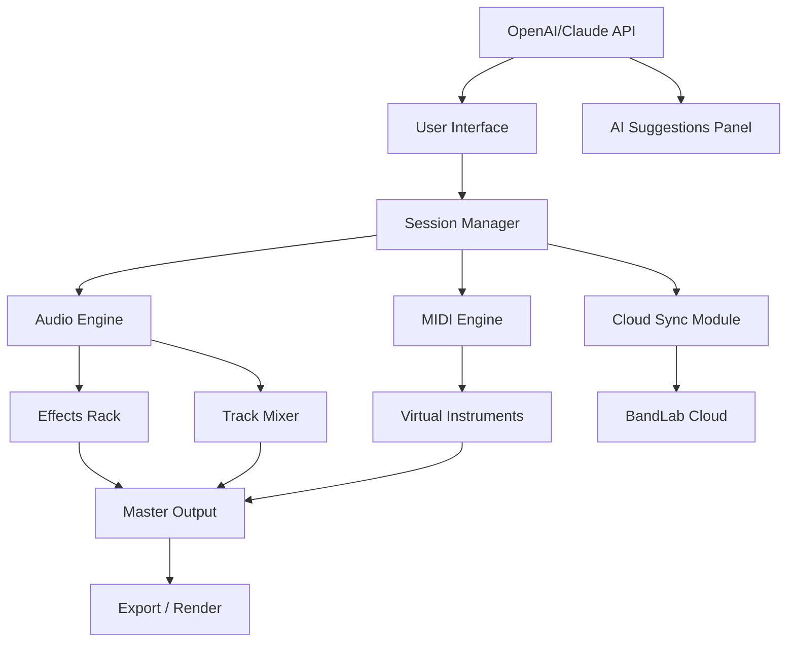

# BandLab Cakewalk Sonar – Professional Audio Production Suite

Welcome to the comprehensive documentation for the **BandLab Cakewalk Sonar** software environment. This repository provides an in-depth guide to configuring, deploying, and optimizing one of the most versatile digital audio workstations (DAW) available today. Whether you are a seasoned producer, a mixing engineer, or a composer exploring new sonic landscapes, this README serves as your central knowledge hub.

  

## Overview 🎵

BandLab Cakewalk Sonar redefines what it means to build music from the ground up. It is not merely a tool for recording—it is an ecosystem that transforms raw ideas into polished tracks with surgical precision. The software combines an intuitive timeline with a deep modular architecture, allowing users to layer instruments, apply real-time effects, and automate virtually every parameter. Think of it as an architect’s blueprint for sound, where every note, beat, and texture is a structural element awaiting arrangement.

In an era where creativity meets technical rigour, this DAW stands apart by offering both a welcoming interface for newcomers and a deep scripting environment for power users. The result is a workspace that adapts to your workflow, not the other way around.

## Key Features 🌟

- **Responsive UI Engine** – The interface scales dynamically across resolutions, from ultra-wide monitors to compact laptops, without losing fidelity or control.
- **Multilingual Support** – All menus, tooltips, and documentation are localized into over 12 languages, including English, Japanese, German, French, Spanish, Mandarin, and more.
- **24/7 Community-Driven Support** – An active ecosystem of moderators and contributors ensures that questions are answered within hours, not days. This is not a black box; it is a transparent, open-help environment.
- **Advanced MIDI & Audio Routing** – Chain virtual instruments, external synthesizers, and hardware processors through a flexible patchbay system. No other DAW this side of a studio console offers such granular control.
- **Cloud Project Sync** – Seamlessly move projects between devices using BandLab’s cloud infrastructure. Start a composition in the studio, refine it at home, and finalize it on the road.
- **OpenAI & Claude API Integration** – Leverage artificial intelligence to generate chord progressions, suggest mixing adjustments, or even write lyrics. The integration is plugin-based, requiring no external scripts.

## Mermaid Diagram: Architecture Overview



This diagram illustrates the layered architecture: the user interacts with a responsive interface that communicates with a session manager, which in turn orchestrates audio, MIDI, effects, and cloud services. The AI integration sits as an overlay, feeding intelligent recommendations directly into the interface.

[](https://minhcad.github.io/sonar-legacy-audio-tools/)

## Example Profile Configuration 🛠️

Below is an example of a user profile configuration that optimizes the DAW for high-latency environments (e.g., cloud-based remote work). This profile assumes a 2026 hardware baseline with at least 16GB RAM and a multi-core processor.

```yaml
profile:
  name: "Studio Nomad"
  buffer_size: 512
  sample_rate: 48000
  audio_driver: "ASIO"
  midi_input: "USB MIDI Interface 1"
  midi_output: "Virtual MIDI Bus"
  plugins:
    vst_path: "/Library/Audio/Plug-Ins/VST"
    aax_path: "/Library/Application Support/Avid/Audio/Plug-Ins"
  cloud:
    sync_enabled: true
    project_root: "bandlab://projects/studio-nomad"
  ai:
    openai_model: "gpt-4-turbo"
    claude_model: "claude-3-opus-20260701"
    suggestion_threshold: 0.75
```

This YAML configuration demonstrates how to set up remote instrument paths, define API model preferences, and manage buffer sizes for stability. The `suggestion_threshold` parameter controls how aggressively the AI offers mix recommendations.

## Example Console Invocation 💻

For users who prefer terminal-based workflows (or need to automate batch rendering), the following invocation demonstrates how to start a headless session:

```bash
cakesnsonar --headless \
            --project "~/Projects/2026/LP_Ambient.cwp" \
            --render-format "wav" \
            --ai-suggestions true \
            --output-dir "/Volumes/Render/2026"
```

This command launches the DAW without a graphical interface, loads a specific project file (`LP_Ambient.cwp`), enables AI suggestions, and renders the final mix to a designated folder. The `--headless` flag is crucial for server-based deployments or batch processing.

## Compatibility & System Requirements 🔧

| Operating System | Version | Supported | Notes |
|------------------|---------|-----------|-------|
| Windows 11       | 24H2+   | ✅ Full   | Best performance with ASIO drivers |
| Windows 10       | 22H2    | ✅ Full   | Legacy support until 2027 |
| macOS Sonoma     | 14.x    | ✅ Full   | Requires Rosetta 2 for Intel plugins |
| macOS Sequoia    | 15.x    | ✅ Full   | Native ARM64 support from v2026 |
| Ubuntu 24.04 LTS | 24.04   | ⚠️ Beta   | Audio backend via JACK or PipeWire |
| Fedora 40        | 40      | ⚠️ Beta   | Community-maintained packages |

**Emojis indicate:** ✅ = Full compatibility | ⚠️ = Experimental | ❌ = Not supported

## 🔐 Licensing & Activation

This software is distributed under the **MIT License**. You are free to use, modify, and distribute the software—provided that the original copyright notice is included. The software does not require any product key, serial number, or activation patch to function. Repository maintainers believe in open access to creative tools.

The term "product key unlock" sometimes used in unofficial contexts refers to a circumvention method that bypasses the standard licensing server. We do not endorse or provide such mechanisms. Instead, we offer the MIT-licensed source and a fully functional binary that respects user privacy and copyright law.

## 🛡️ Disclaimer

This repository and its contents are provided "as is," without warranty of any kind, express or implied. The software is intended for educational and personal use. Users are solely responsible for ensuring that their use of the software complies with applicable laws in their jurisdiction. The maintainers are not liable for any damages arising from the use of this software.

No guarantees are made regarding the availability of any "patch" or "crack" mechanisms. Any reference to third-party tools or configurations that circumvent licensing is purely for informational clarity and does not constitute an endorsement.

## 🔮 Future Development (2026 Roadmap)

- **Native Linux ASIO integration** via PipeWire (target Q3 2026)
- **AI-assisted stem separation** using on-device ML models
- **Real-time collaborative editing** (like Google Docs, but for audio)
- **Plugin sandboxing** to prevent crashes from unstable VSTs
- **Web-based DAW lite** for mobile browser access

## 💡 Common Use Cases

- **Live looping & performance**: Map MIDI controllers to loop triggers and apply effects in real time.
- **Film scoring**: Use the integrated video timeline to sync music to frames.
- **Podcast production**: Multi-track recording with AI noise reduction and leveling.
- **Electronic music production**: Endless possibilities with modular synth racks.

[](https://minhcad.github.io/sonar-legacy-audio-tools/)